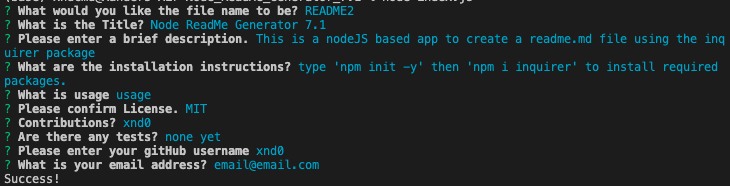

# Node_ReadMe_Generator_7.1

## Title: Node_ReadMe_Generator_7.1
 

## Description:
This is a command-line based application to create a readme.md file using the inquirer package
  

## Installation Instructions:
Enter: 'npm init -y'  
Then: 'npm i inquirer'  
(to install required packages)
  
## Usage:
Enter: 'node index.js' in terminal to start the app. 
  

## Screenshot of example usage:

## Technologies Used:
Javascript
